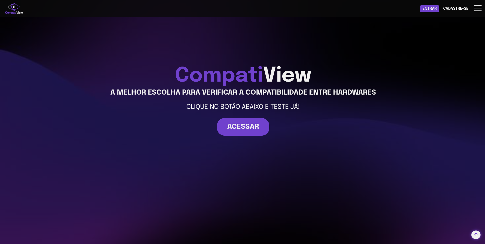
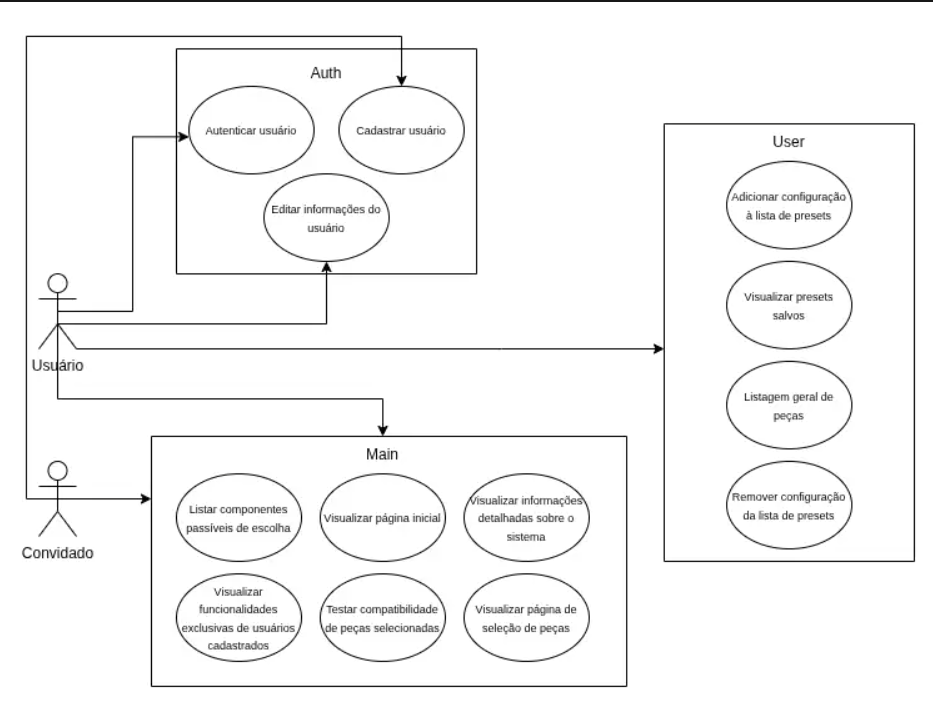
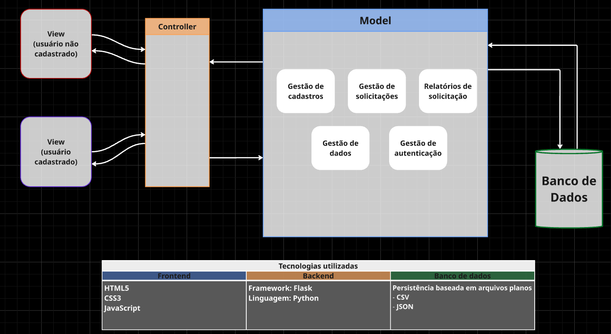

## <div align="center">CompatiView</div>

> **Engenharia de Software 2026.1 - IFPB**<br>
> Projeto Integrador

### Sumário
- [Sobre o Projeto](#-sobre-o-projeto)
    - [Tecnologias](#tecnologias-utilizadas)
- [Funcionalidades](#-funcionalidades)
- [Casos de Uso](#diagrama-de-casos-de-uso)
- [Arquitetura](#arquitetura-do-sistema)
- [Estrutura](#estrutura-do-projeto)
- [Guia de Execução](#-guia-de-execução)

## 📝 Sobre o Projeto


O CompatiView é uma aplicação web desenvolvida com o intuito de ser facilmente utilizada por qualquer tipo de pessoa. Com uma interface simples e singela, o sistema tem como objetivo principal auxiliar seus usuários em suas montagens de setups compativeis e funcionais.

Este projeto conta com:
- Proteção de rotas
- Sistema de cadastro
- Modularização em blueprints
- Persistências baseadas em arquivos planos
    - CSV
    - JSON

### Tecnologias utilizadas

- Linguagens 
    - Python 3.x
    - HTML5
    - CSS3
    - JavaScript
- Microframework
    - Flask

## 📚 Funcionalidades

### Para Usuários Cadastrados

- Acesso à funcionalidade principal do sistema: O usuário consegue selecionar os componentes de sua preferência para realizar um teste de compatibilidade e receber um feedback de acordo com sua requisição.

- Salvamento de presets: O sistema disponibiliza o salvamento de configurações para usuários cadastrados.

- Acesso à uma listagem geral de peças e seus preços médios estimados no mercado atual.

- Autenticação Segura: Sistema completo de cadastro, login, logout e remoção de conta.

- Perfil Personalizado: Cada usuário tem uma página de perfil onde pode editar suas informações. Além de também conseguir gerenciar e visualizar seus salvamentos.

### Para Convidados (Usuários não cadastrados).

- Acesso à funcionalidade principal do sistema.

- Autenticação segura.

## Diagrama de Casos de Uso
Segue abaixo a modelagem dos **casos de uso** do sistema.


## Arquitetura do Sistema
O projeto segue uma arquitetura em camadas ou, mais especificamente, o padrão MVC (Model-View-Controller)


## Estrutura do projeto
```text
CompatiView/
├── .venv/                  # Ambiente virtual Python
├── .env                    # Arquivo de variáveis de ambiente
├── app/                    # Diretório principal da aplicação
│   ├── __init__.py
│   ├── auth/               # Módulo de Autenticação
│   │   ├── __init__.py
│   │   └── routes.py
│   ├── main/               # Módulo Principal (Main Blueprint)
│   │   ├── __init__.py
│   │   └── routes.py
│   ├── static/             # Arquivos estáticos (CSS, JS, Imagens)
│   │   ├── css/
│   │   ├── imgs/
│   │   └── js/
│   ├── templates/          # Templates HTML
│   │   ├── auth/
│   │   ├── errors/
│   │   ├── main/
│   │   ├── user/
│   │   ├── base_auth.html
│   │   └── base.html
│   ├── user/               # Módulo de Usuário
│   │   ├── __init__.py
│   │   └── routes.py
│   ├── utils/              # Funções utilitárias/ajudantes
│   │   ├── __init__.py
│   │   ├── compatibilidade.py
│   │   └── data_manager.py
│   └── security.py
├── app.py                  # Ponto de entrada do aplicativo
├── config.py               # Arquivo de configuração que lê o .env
├── README.md               
└── requirements.txt        # Dependências do projeto
```

---

## 🚀 Guia de Execução

Este projeto utiliza o microframework **Flask**. Siga os passos abaixo para baixar, configurar e rodar a aplicação localmente no seu computador.

### 📥 Passo 1: Clonar o Repositório
Abra o terminal do seu sistema operacional e baixe o projeto utilizando o Git:
```bash
git clone https://github.com/Nycolas-Dleon/CompatiView.git
```

### ⚠️ Passo 2: Variáveis de Ambiente (Obrigatório)
Para que a aplicação (especialmente a proteção de rotas e o sistema de login) funcione corretamente, é necessário configurar a chave de segurança. 

Entre na pasta do projeto e, na raiz (mesmo nível de `app.py`), crie um arquivo chamado `.env` contendo a seguinte linha:
```env
SECRET_KEY=sua_chave_secreta_aqui
```
#### Linux/macos
```bash
cd CompatiView
echo "SECRET_KEY=sua_chave_secreta_aqui" > .env
```

#### Windows
```powershell
cd CompatiView
echo SECRET_KEY=sua_chave_secreta_aqui > .env
```
Uma chave forte pode ser gerada com:

```python
python -c "import secrets; print(secrets.token_hex(32))"
```

### 💻 Passo 3: Executando o Projeto

Selecione o seu sistema operacional abaixo para ver os comandos de inicialização pelo terminal.

#### 🐧 Linux
```bash
# 1. Navegue até a pasta do projeto clonado
cd CompatiView

# 2. Crie e ative o ambiente virtual
python3 -m venv .venv
source .venv/bin/activate

# 3. Instale as dependências
pip install -r requirements.txt

# 4. Execute a aplicação
python3 app.py
```

#### 🍏 macOS
```bash
# 1. Navegue até a pasta do projeto clonado
cd CompatiView

# 2. Crie e ative o ambiente virtual
python3 -m venv .venv
source .venv/bin/activate

# 3. Instale as dependências
pip install -r requirements.txt

# 4. Execute a aplicação
python3 app.py
```

#### 🪟 Windows
Abra o **PowerShell** ou **Prompt de Comando (CMD)** e execute:
```powershell
# 1. Navegue até a pasta do projeto clonado
cd CompatiView

# 2. Crie e ative o ambiente virtual (PowerShell)
python -m venv .venv
.venv\Scripts\Activate.ps1
# (Se estiver usando CMD, utilize: .venv\Scripts\activate.bat)

# 3. Instale as dependências
pip install -r requirements.txt

# 4. Execute a aplicação
python app.py
```
> *Nota para Windows:* Se receber um erro ao ativar o ambiente no PowerShell informando que a execução de scripts está desabilitada, rode o comando `Set-ExecutionPolicy -ExecutionPolicy RemoteSigned -Scope Process` primeiro.

### 🌐 Acessando a Aplicação
Com o servidor rodando, abra o seu navegador e acesse:
**http://127.0.0.1:5000** ou **http://localhost:5000**

## Autores
- **João Pedro Alencar** - Desenvolvimento Full Stack - [@07joaopedro](https://github.com/07joaopedro)
- **Nycolas-Dleon** - Desenvolvimento Full Stack - [@Nycolas-Dleon](https://github.com/Nycolas-Dleon)
- **Lucas Linhares** - Desenvolvimento Full Stack - [@LucasLinhares](https://github.com/dreadanchor)
- **Wesley Lins** - Desenvolvimento Full Stack - [@WesleyLins](https://github.com/wsllins)
